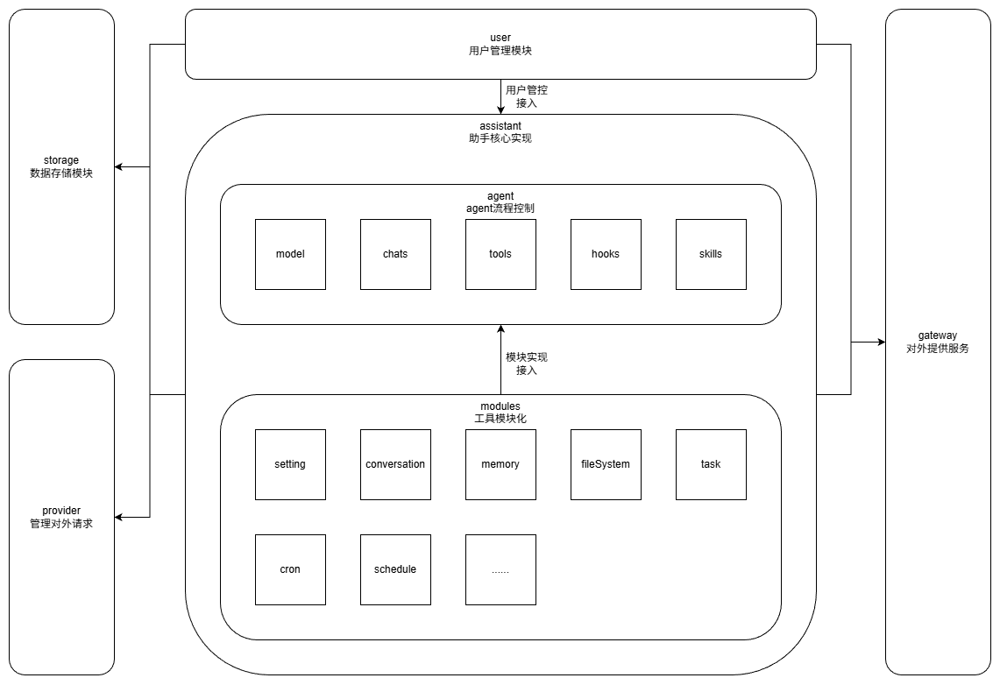

# Genban 架构设计

## 架构图



## 技术栈

- **编程语言**: Python
- **Web 框架**: FastAPI
- **数据库**: SQLite

## 架构概述

Genban 采用分层架构设计，从外到内分为以下层次：

1. **Gateway 层**: 外部对接管理，统一对外提供接口
2. **User 层**: 用户管理模块，负责用户管控接入
3. **Assistant 层**: 助手核心实现，利用 Agent 实现流程控制，并向 Agent 注入 Modules 能力
4. **Agent 层**: AI 调用流程编排，负责单次 AI 调用的完整流程
5. **Model 层**: 大模型接口管理，统一封装不同模型 Provider 的调用
6. **Modules 层**: 应用功能模块化，为 Agent 提供个性化能力
7. **Storage 层**: 数据存储管理，负责数据的持久化与访问
8. **Provider 层**: 对外请求管理，负责调用外部服务接口

---

## 模块划分

### 1. Gateway（外部对接管理）

**职责**: 统一对外接口管理，负责外部请求的路由、认证与响应

**功能**:
- **API 路由**: 统一管理所有对外 API 接口
- **请求认证**: JWT Token 验证、权限校验
- **日志记录**: 请求/响应日志
- **SSE 流式推送**: 支持 Server-Sent Events 实时消息推送

**子模块**:

| 名称 | 职责 | 关键组件 |
|------|------|----------|
| Web | Assistant 模块的 HTTP 接口和 SSE 流管理 | assistant_controller、stream_manager、sse_formatter |

#### Web 子模块详解

Web 子模块位于 `src/gateway/web/`，负责 Assistant 模块的对外 HTTP 接口和 SSE 流式消息推送。

**核心组件**:

| 组件 | 文件 | 职责 |
|------|------|------|
| assistant_controller | assistant_controller.py | 定义 `/submit`、`/stop`、`/stream` 三个核心接口 |
| entities | entities.py | 定义请求/响应的 Pydantic 模型（SubmitRequest、SubmitResponse、StopResponse） |
| stream_manager | stream_manager.py | 管理用户 SSE 连接，从 Assistant 拉取消息并推送到前端 |
| sse_formatter | sse_formatter.py | 将内部 Chat 对象格式化为 SSE 格式 |
| routers | routers.py | 集中注册所有模块的路由 |

**接口列表**:

| 接口 | 方法 | 路径 | 说明 |
|------|------|------|------|
| submit | POST | /api/assistant/submit | 提交用户消息到处理队列 |
| stop | POST | /api/assistant/stop | 停止当前对话 |
| stream | GET | /api/assistant/stream | 建立 SSE 连接，流式推送消息 |

**数据流**:

```
前端 → POST /submit → assistant_controller → assistant_manager.submit_chat()
                                               ↓
前端 ← SSE /stream ← stream_manager ← Assistant 消息分发
```

1. 前端调用 `/submit` 提交消息 → 创建 Chat 对象 → 提交到 AssistantManager
2. 前端建立 `/stream` SSE 连接 → StreamManager 订阅用户消息管道
3. Assistant 处理消息产生新 Chat → 通过监听器推送到 StreamManager
4. StreamManager 格式化消息为 SSE → 推送到前端

---

### 2. User（用户管理模块）

**职责**: 用户身份认证与权限管理，为 Assistant 提供用户管控接入

**功能**:
- **用户管理**: 管理用户账户
- **身份认证**: JWT Token 生成与验证

---

### 3. Assistant（助手核心实现）

**职责**: AI 个人助理的核心实现，整合 Agent 流程控制与 Modules 工具模块化能力，管理用户与 Agent 的交互生命周期

**关键设计**:
- **AssistantManager**: 管理所有用户的 Assistant 实例，提供单例管理
- **用户隔离**: 每个用户拥有独立的 Assistant 实例，互不干扰
- **模块注入**: Assistant 初始化时创建并注入所有功能模块（FileSystem、Shell、Memory 等）
- **消息分发**: 通过 `agent.recv_chat()` 获取 Agent 输出消息，分发给注册的监听器
- **生命周期管理**: 支持非活动超时自动停止机制，资源按需释放
- **监听器模式**: 支持注册/注销消息监听器，实现消息的广播分发

**核心组件**:

| 组件 | 文件 | 职责 |
|------|------|------|
| AssistantManager | assistant_manager.py | 管理所有用户的 Assistant 实例，提供获取、消息提交、监听器注册等功能 |
| Assistant | assistant.py | 单个用户的助手实例，管理 Agent 生命周期和消息分发 |


**数据流**:
1. 前端调用 `/submit` 提交消息 → AssistantManager 获取用户 Assistant → 调用 `send_chat()`
2. Assistant 调用 `agent.send_chat()` 将消息送入 Agent 输入管道
3. Agent 内部主循环处理消息，产生的新消息通过输出管道输出
4. Assistant 的 `_distribute_chat` 循环通过 `agent.recv_chat()` 拉取消息
5. 过滤非用户可见消息，将可见消息分发给所有注册的监听器
6. StreamManager 监听器将消息通过 SSE 推送到前端

**生命周期管理**:
- **启动**: 首次发送消息或注册监听器时自动启动分发线程
- **运行**: 持续监听 Agent 输出并分发消息
- **停止**: 当无监听器且超过非活动超时时间时自动停止
- **超时配置**: 通过 `app_config.assistant.inactive_timeout` 配置

---

### 4. Agent（AI 调用流程编排）

**职责**: Agent 是单次 AI 调用的流程编排器，基于消息管道架构实现异步处理。负责整合模型调用、工具调用和生命周期钩子，完成从用户输入到 AI 响应的完整流程。

**核心能力**:
- **消息管道架构**: 通过 `in_message_pipe` 接收输入，`out_message_pipe` 输出结果，实现异步解耦
- **流式响应支持**: 通过流式调用获取模型响应，实时推送到输出管道
- **工具调用循环**: 自动处理模型触发的工具调用，支持多轮工具调用（最大50次迭代）
- **生命周期钩子**: 在关键节点提供 4 个钩子点位，支持自定义逻辑注入
- **双模式消息拉取**: 支持阻塞和非阻塞两种消息拉取模式

**架构设计**:

```
┌─────────────────────────────────────────────────────────────┐
│                         Agent                               │
│  ┌─────────────────┐         ┌─────────────────────────┐   │
│  │ in_message_pipe │────────▶│      主循环 (_run)       │   │
│  │   (输入管道)     │         │  ┌───────────────────┐  │   │
│  └─────────────────┘         │  │  阻塞/非阻塞拉取   │  │   │
│                              │  │  消息处理流程      │  │   │
│                              │  └───────────────────┘  │   │
│  ┌─────────────────┐         └───────────┬─────────────┘   │
│  │ out_message_pipe│◀────────────────────┘                 │
│  │   (输出管道)     │                                       │
│  └─────────────────┘                                       │
└─────────────────────────────────────────────────────────────┘
```

**子模块**:

| 名称 | 职责 | 关键组件 |
|------|------|----------|
| Chats（对话） | 定义 Agent 对话内容格式 | Chat、Message、MessageRole、chat_factory |
| Tools（工具） | 实现 Agent 工具调用能力 | BaseTool、ToolCaller、ToolRegistry、ToolParameter、ToolCall、ToolResult |
| Hooks（钩子） | 支持 Agent 生命周期的回调与事件监听 | BaseHook、HookManager、HookRegistry |
| Entities（实体） | 定义 Agent 执行上下文和数据结构 | AgentContext、ModelConfig、MessagePipeContent |

**钩子点位（按执行顺序）**:

| 钩子类型 | 入参类型 | 出参类型 | 执行方式 | 说明 |
|---------|---------|---------|---------|------|
| ModelHook | ModelConfig | ModelConfig | 同步 | 决定使用哪个模型配置（首个执行） |
| PromptHook | list[Chat] | list[Chat] | 同步 | 处理提示词对话列表 |
| HistoryChatsHook | list[Chat] | list[Chat] | 同步 | 处理历史对话列表 |
| ConfirmedChatHook | Chat | Chat | 异步 | 处理已确认的新增对话（模型响应、工具结果等） |

**模块边界**:
- **输入**: 通过 `in_message_pipe` 接收 Chat 对象（用户输入）
- **输出**: 通过 `out_message_pipe` 推送所有新增的 Chat 对象（assistant 响应、tool 结果等）
- **不处理**: 历史对话的存储与检索（由上层调用方管理）、多轮对话的会话管理
- **依赖**: ModelCaller（模型调用）、ToolCaller（工具执行）、HookManager（钩子管理）

**关键设计决策**:

1. **消息管道架构**: Agent 采用生产者-消费者模式，通过输入/输出管道实现与调用方的异步解耦，调用方无需等待 Agent 完成即可发送下一条消息

2. **双模式拉取**: 
   - 流程1（阻塞模式）: 等待用户新输入，节省资源
   - 流程2（非阻塞模式）: 工具调用后快速继续，支持连续工具调用链

3. **异步钩子执行**: `ConfirmedChatHook` 采用异步执行，避免阻塞主流程，适合用于消息持久化、日志记录等操作

---

### 5. Model（模型层）

**职责**: 管理大模型接口的统一调用，为 Agent 提供模型调用能力

**核心能力**:
- **统一接口**: 封装不同模型 Provider 的调用差异
- **流式响应**: 支持流式调用获取模型响应
- **多模型支持**: 支持多种模型 Provider（DashScope、DashScope MultiModal 等）

**子模块**:

| 名称 | 职责 | 关键组件 |
|------|------|----------|
| Model（模型） | 管理大模型接口的统一调用 | ModelCaller、ModelProvider、CallResponse |

---

### 6. Modules（应用功能模块化）

**职责**: 应用功能的模块化，为 Agent 提供个性化的应用能力。模块是 Agent 能力的核心载体，通过模块注册机制将工具和钩子注入 Agent。

**核心设计**:

模块系统采用 **BaseModule 抽象基类** 作为统一接口，每个模块通过类属性定义元数据，在 `__init__` 中初始化工具和钩子实例。

**子模块**:

| 名称                 | 职责                                    |
| ------------------ | ------------------------------------- |
| FileSystem（文件系统模块） | 向 Agent 提供文件系统操作能力（read_file、write_file、edit_file） |
| Shell（命令行模块）        | 向 Agent 提供命令行调用能力（shell）                     |
| Setting（配置模块）      | 系统配置与用户个性化设置管理（setting）                   |
| Skills（技能模块）       | 向 Agent 提供可扩展的 Skill 能力（get_skill_info）       |
| Web（网络模块）          | 向 Agent 提供网络访问能力（web_search、web_fetch）       |
| UserMessage（用户消息模块） | 定义用户消息格式和标签                      |
| SystemRemainder（系统消息模块） | 定义系统提示消息格式和标签              |
| Memory（记忆模块）       | 向 Agent 提供记忆存储与检索能力              |
| Schedule（日程模块）     | 向 Agent 提供日程管理能力                    |

---

### 7. Storage（数据存储管理）

**职责**: 负责数据的持久化存储与访问，为上层模块提供统一的数据操作接口

**子模块**:
- **Database**: 数据库连接与管理（SQLite）
- **Vector Store**: 向量数据库存储（用于记忆语义检索）
- **File Store**: 文件存储管理（本地文件系统、对象存储等）

---

### 8. Provider（对外请求管理）

**职责**: 统一管理所有对外部服务的调用，封装第三方接口的请求逻辑

**子模块**:
- **API DashScope**: 阿里云 DashScope 大模型 API 封装
- **API Zai SDK**: 智谱 AI SDK 封装（网络搜索等）

---

## 日志规范

### 日志架构

项目采用统一的日志管理架构，所有模块通过 `src/common/logger.py` 获取日志记录器

### 各层日志职责

| 层次 | 日志级别 | 记录内容 |
|------|----------|----------|
| **Gateway 层** | INFO/ERROR | HTTP 请求接收、响应、异常 |
| **Assistant 层** | INFO/DEBUG | 消息分发、监听器状态 |
| **Agent 层** | DEBUG/INFO | 执行流程、模型调用、工具调用、管道消息 |
| **Modules 层** | DEBUG/INFO | 文件操作、命令执行、Skill 操作 |
| **Provider 层** | INFO/ERROR | 外部 API 调用、响应、异常 |
| **Storage 层** | DEBUG/ERROR | 数据库操作、文件存储 |

### 日志级别使用规范

| 级别 | 使用场景 |
|------|----------|
| **DEBUG** | 详细的调试信息，如函数入参、执行流程步骤、循环迭代次数 |
| **INFO** | 重要的业务操作，如请求接收、处理完成、外部 API 调用 |
| **WARNING** | 警告信息，如权限拒绝、资源不存在、非预期的输入 |
| **ERROR** | 错误信息，如异常捕获、操作失败、外部服务错误 |
| **CRITICAL** | 严重错误，系统级错误、关键组件故障 |

### 日志配置

日志配置文件 `src/config/jsons/logging_config.json`